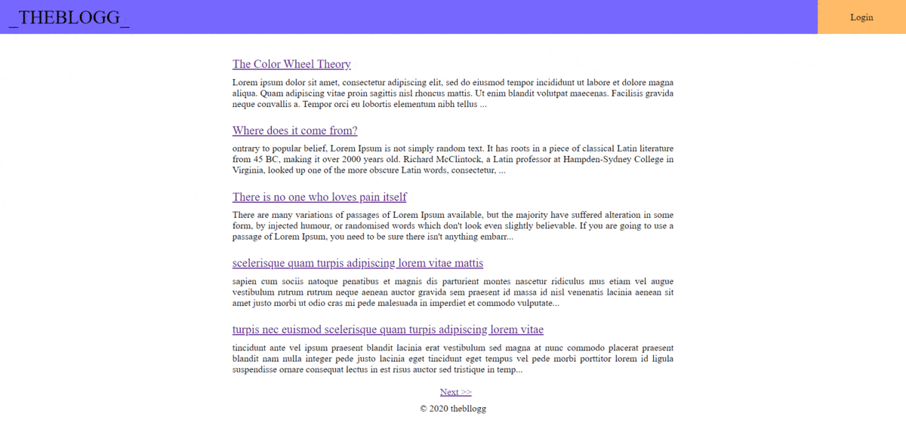

# blog-engine-app

Simple blog engine build in node with typescript and MongoDB as database server.

### `npm install`
### `npm run dev`

Runs the app in the development mode.
Open [http://localhost:3000](http://localhost:3000) to view it in the browser.
Require node and mongodb installed

### License
----
MIT

